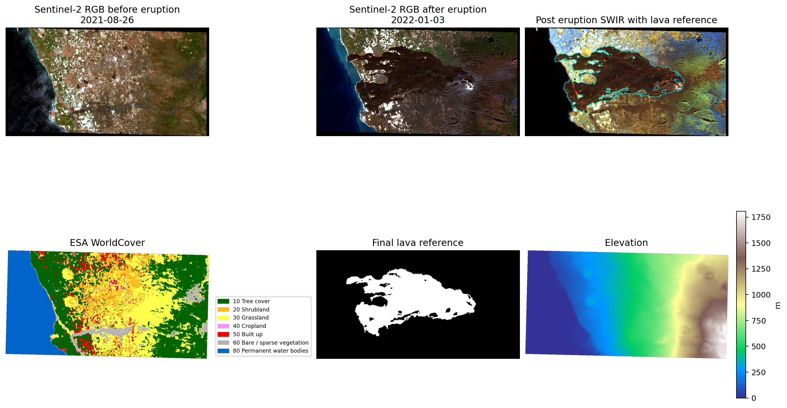
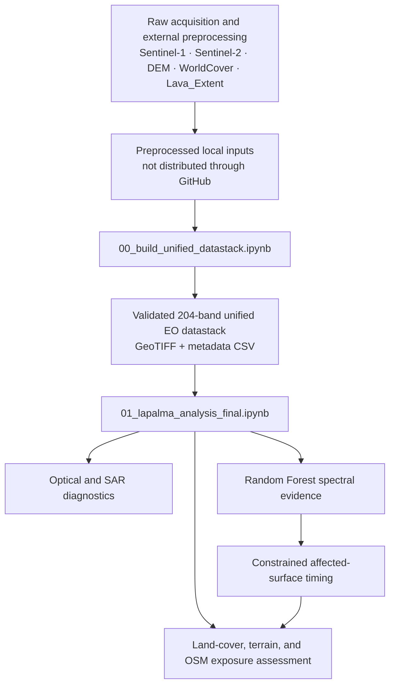
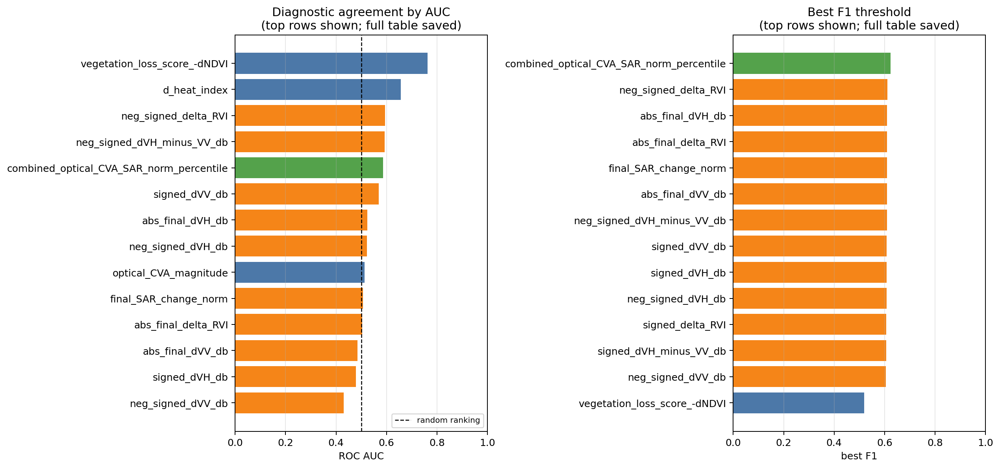
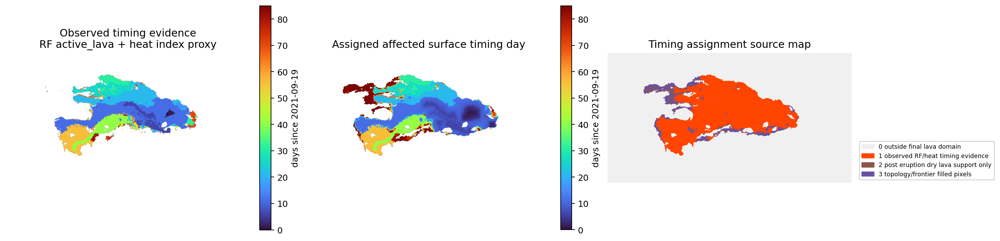
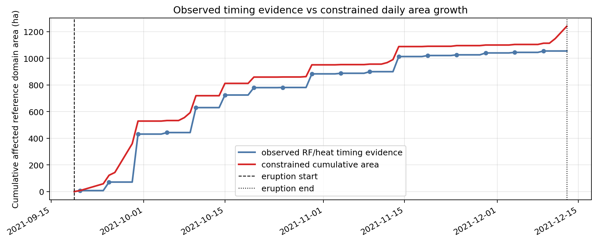
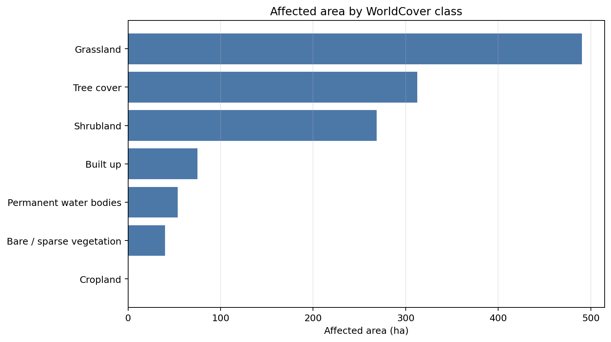
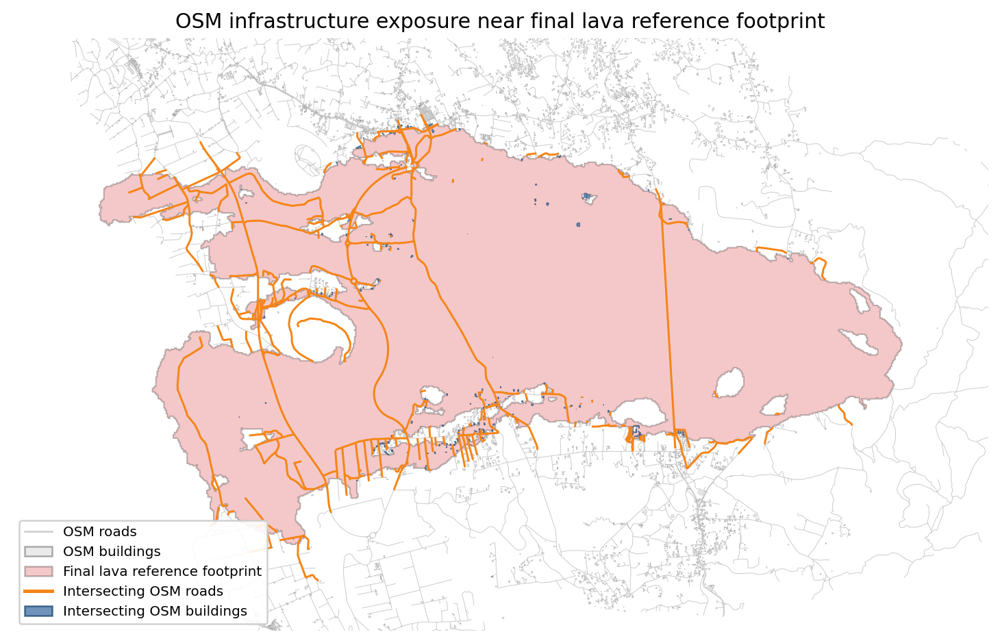

# La Palma 2021: Multi-Sensor Earth Observation Analysis and Impact Assessment

Interpretable multi-sensor Earth Observation workflow for the 2021 Tajogaite eruption on La Palma, combining Sentinel-2, Sentinel-1, terrain, land-cover, reference data, machine learning, constrained temporal reconstruction, and exposure assessment.

## Overview

This repository documents a downstream EO analysis workflow built around a validated unified datastack.

The project is not presented as a single lava-classification benchmark. Instead, it follows a complete analytical chain:

- harmonization of preprocessed multi-source EO inputs;
- construction and validation of a 204-band analysis-ready datastack;
- optical and SAR change diagnostics;
- Random Forest organization of Sentinel-2 spectral evidence;
- constrained affected-surface timing reconstruction;
- land-cover, terrain, and optional infrastructure-exposure assessment.

The workflow was developed for the **AI and Big Data for Earth Observation** course at UPC and subsequently curated as a public, portfolio-oriented repository.

> [!IMPORTANT]
> The public repository does **not** include the canonical 204-band GeoTIFF or the preprocessed Sentinel-1, Sentinel-2, DEM, WorldCover, and professor-provided lava-extent inputs required to reconstruct it.
>
> Consequently, the notebooks cannot be executed end-to-end using the tracked GitHub files alone. Users must provide either the canonical datastack or the complete set of required preprocessed inputs locally. See [`data/README.md`](data/README.md) and [`docs/DATA_PIPELINE.md`](docs/DATA_PIPELINE.md).

## Case study and motivation

The case study focuses on the 2021 Tajogaite eruption on La Palma.

Satellite observations provide complementary but incomplete evidence:

- **Sentinel-2** captures optical, vegetation, NIR, and SWIR responses, but observations can be obstructed by clouds.
- **Sentinel-1** provides cloud-independent radar observations, but backscatter changes are not specific to lava.
- **Terrain and land-cover data** provide environmental context.
- The professor-provided **`Lava_Extent`** layer supplies the accepted final affected-domain reference used to constrain timing reconstruction and impact assessment.

The main objective is to preserve this distinction:

1. spectral change evidence;
2. assigned affected-surface timing;
3. accepted final affected area.

The Random Forest organizes spectral evidence but does not define an unconstrained final lava footprint. The timing reconstruction fills temporal gaps only inside the accepted final reference domain.

## Project at a glance

| Property | Value |
|---|---:|
| Study event | 2021 Tajogaite eruption, La Palma |
| Target CRS | EPSG:32628 |
| Analysis grid | 582 × 1090 pixels |
| Spatial resolution | 10 m |
| Unified datastack | 204 bands |
| Sentinel-2 coverage | 25 dates, 6 bands per date |
| Sentinel-1 coverage | 5 dates, VV and VH |
| Reconstruction interval | 2021-09-19 to 2021-12-13 |
| Accepted final reference area | 1,240.96 ha |



*Selected analysis inputs: Sentinel-2 pre/post imagery, post-eruption SWIR evidence, ESA WorldCover, the accepted final lava reference, and elevation.*

## Workflow



The repository does not fully reproduce raw Sentinel acquisition, the original Google Earth Engine workflow, or the complete SNAP preprocessing chain. These upstream stages and the repository reproducibility boundary are described in [`docs/DATA_PIPELINE.md`](docs/DATA_PIPELINE.md).

## Data

The canonical downstream inputs are expected locally at:

```text
data/processed/unified/LaPalma_unified_datastack_EPSG32628_10m.tif
data/metadata/LaPalma_unified_datastack_band_metadata.csv
```

The unified datastack contains:

| Component | Bands |
|---|---:|
| Sentinel-2 reflectance | 150 |
| Sentinel-1 VV/VH backscatter | 10 |
| Static layers | 6 |
| Sentinel-2 validity masks | 25 |
| Sentinel-1 validity masks | 5 |
| Static and analysis-domain masks | 5 |
| Pre/post comparison masks | 3 |
| **Total** | **204** |

Static layers include ESA WorldCover, the accepted lava reference, elevation, slope, aspect, and hillshade.

For the complete local directory layout, input filenames, scaling conventions, and datastack schema, see:

- [`data/README.md`](data/README.md)
- [`data/metadata/README_datastack.md`](data/metadata/README_datastack.md)
- [`data/metadata/LaPalma_unified_datastack_band_metadata.csv`](data/metadata/LaPalma_unified_datastack_band_metadata.csv)

## Methodology

### 1. Datastack harmonization and validation

[`notebooks/00_build_unified_datastack.ipynb`](notebooks/00_build_unified_datastack.ipynb) consolidates already-preprocessed EO and auxiliary inputs on a common 10 m grid.

It performs:

- input and reference-grid validation;
- sensor-specific alignment and resampling;
- Sentinel-2 reflectance-scale harmonization;
- Sentinel-1 project-convention dB transformation;
- creation of validity and comparison masks;
- generation of canonical band metadata;
- validation of the final 204-band structure.

This notebook is a harmonization and consolidation step, not a complete raw-data-to-datastack pipeline.

### 2. Optical and SAR change diagnostics

[`notebooks/01_lapalma_analysis_final.ipynb`](notebooks/01_lapalma_analysis_final.ipynb) derives optical indices and change features including:

```text
NDVI · NBR · NDMI · BSI · heat_index · SWIR slope
```

It also evaluates Sentinel-1 VV/VH changes, RVI-based features, temporal backscatter differences, optical Change Vector Analysis, and a simple combined optical/SAR diagnostic.



*Agreement of continuous optical, SAR, and combined change scores with the accepted final reference. These are diagnostic comparisons, not independent field validation.*

### 3. Random Forest spectral evidence

A Random Forest organizes Sentinel-2 observations into four pseudo-label classes:

```text
active_lava · dry_lava · cloud · other
```

The model uses the six Sentinel-2 bands together with `heat_index`, NDVI, and SWIR slope.

Pseudo-labels are generated from conservative spectral rules on selected dates. Spatial block splitting reduces direct local leakage between training and evaluation samples.

The reported validation accuracy is approximately **0.991**, but this measures consistency with held-out pseudo-labels rather than field-validated classification accuracy.

### 4. Constrained timing reconstruction

Sparse RF and heat-index detections provide observed timing anchors during the eruption window.

The reconstruction then combines:

- the accepted final lava-reference domain;
- the Tajogaite vent location;
- slope-weighted geodesic ordering;
- monotonic cumulative-area constraints;
- local frontier propagation;
- the known eruption-end constraint.



*Left: observed RF/heat-index timing evidence. Centre: assigned affected-surface timing. Right: provenance of each assigned pixel, separating direct evidence from constrained interpolation.*

The result is a timing proxy inside the accepted final footprint. It is **not** a physical lava-flow simulation, a hydraulic model, or a literal daily map of active lava.

### 5. Impact and exposure assessment

The accepted final reference footprint—rather than RF predictions—defines the affected area used for:

- ESA WorldCover land-cover summaries;
- elevation and slope summaries;
- assigned timing by land-cover class;
- optional OpenStreetMap building and road intersections.

WorldCover and OSM results are exposure proxies, not official damage statistics.

A complete technical description is available in [`docs/METHODOLOGY.md`](docs/METHODOLOGY.md).

## Key results

### Multi-sensor change evidence

The strongest ranking agreement with the accepted reference came from optical vegetation loss:

| Diagnostic | Result | Interpretation |
|---|---:|---|
| Vegetation-loss score, `-ΔNDVI` | ROC AUC 0.763 | Best overall ranking agreement |
| SWIR/NIR `Δheat_index` | ROC AUC 0.657 | Useful lava-like spectral evidence |
| Best SAR-only score, negative signed ΔRVI | ROC AUC 0.595 | Weaker standalone detector, useful supporting evidence |
| Combined optical-CVA/SAR score | Best F1 0.623 | High recall, but low specificity and substantial overprediction |

The diagnostic benchmark supports Sentinel-1 as cloud-independent temporal context, not as a replacement for optical evidence or the constrained reconstruction.

Full metrics: [`outputs/tables/final_change_detection_method_comparison.csv`](outputs/tables/final_change_detection_method_comparison.csv)

### Timing reconstruction

The accepted final domain contains **124,096 pixels**, corresponding to **1,240.96 ha**.

| Timing source | Pixels | Share of final domain |
|---|---:|---:|
| Direct RF/heat-index timing evidence | 105,519 | 85.03% |
| Post-eruption dry-lava support | 4,826 | 3.89% |
| Topology/frontier-filled timing | 13,751 | 11.08% |
| **Total** | **124,096** | **100%** |



*Observed cumulative timing evidence and the constrained daily reconstruction. Completion is imposed inside the accepted reference domain by 2021-12-13.*

Reconstruction summary: [`outputs/tables/final_lava_reconstruction_summary.csv`](outputs/tables/final_lava_reconstruction_summary.csv)

### Land-cover exposure

The three dominant affected WorldCover classes are:

| WorldCover class | Affected area | Share of affected area |
|---|---:|---:|
| Grassland | 490.56 ha | 39.53% |
| Tree cover | 312.65 ha | 25.19% |
| Shrubland | 268.78 ha | 21.66% |
| Built up | 75.16 ha | 6.06% |



*WorldCover exposure inside the accepted final footprint. The `Built up` class is a raster land-cover category, not a building count.*

Full table: [`outputs/tables/final_landcover_impact_summary.csv`](outputs/tables/final_landcover_impact_summary.csv)

### Optional OSM infrastructure exposure

Using the locally prepared OSM vector layers, the accepted reference footprint intersects:

- **201 mapped building footprints**;
- approximately **34.18 km of mapped roads**.



*Mapped buildings and roads intersecting the accepted final affected footprint. Intersections indicate potential exposure, not confirmed destruction or official damage counts.*

Related tables:

- [`outputs/tables/final_osm_building_exposure_summary.csv`](outputs/tables/final_osm_building_exposure_summary.csv)
- [`outputs/tables/final_osm_road_exposure_summary.csv`](outputs/tables/final_osm_road_exposure_summary.csv)
- [`outputs/tables/final_osm_road_exposure_by_type.csv`](outputs/tables/final_osm_road_exposure_by_type.csv)

## Repository structure

```text
la-palma-eruption-eo-analysis/
├── README.md
├── LICENSE
├── requirements.txt
├── .gitignore
│
├── notebooks/
│   ├── 00_build_unified_datastack.ipynb
│   └── 01_lapalma_analysis_final.ipynb
│
├── docs/
│   ├── DATA_PIPELINE.md
│   ├── METHODOLOGY.md
│   └── LIMITATIONS.md
│
├── data/
│   ├── README.md
│   └── metadata/
│       ├── LaPalma_unified_datastack_band_metadata.csv
│       └── README_datastack.md
│
├── outputs/
│   ├── figures/
│   ├── maps/
│   └── tables/
│
└── report/
    └── AI4EO_report_final.pdf
```

Large source rasters, NetCDF inputs, the canonical GeoTIFF, generated arrays, and model binaries are excluded from Git.

## How to run

### 1. Clone the repository

```bash
git clone https://github.com/marcorags/la-palma-eruption-eo-analysis.git
cd la-palma-eruption-eo-analysis
```

### 2. Create a Python environment

The notebooks were prepared for Python 3.11.

```bash
python -m venv .venv
```

Activate it:

```powershell
# Windows PowerShell
.venv\Scripts\Activate.ps1
```

```bash
# macOS or Linux
source .venv/bin/activate
```

Install the dependencies:

```bash
python -m pip install --upgrade pip
pip install -r requirements.txt
```

Launch Jupyter:

```bash
jupyter lab
```

### 3. Supply the required data locally

Two execution paths are possible.

#### Option A — Run the downstream analysis

Provide:

```text
data/processed/unified/LaPalma_unified_datastack_EPSG32628_10m.tif
data/metadata/LaPalma_unified_datastack_band_metadata.csv
```

Then run:

```text
notebooks/01_lapalma_analysis_final.ipynb
```

#### Option B — Rebuild a candidate datastack

Provide all preprocessed Sentinel-1, Sentinel-2, terrain, WorldCover, and lava-reference inputs documented in [`data/README.md`](data/README.md).

Then use:

```text
notebooks/00_build_unified_datastack.ipynb
```

The public notebook defaults to:

```python
BUILD_CANDIDATE_OUTPUTS = False
```

Candidate generation must be enabled explicitly. Candidate files are validated and remain separate from the canonical products until manually reviewed and promoted.

## Selected outputs

### Figures

- [Multi-sensor input overview](outputs/figures/final_input_overview.png)
- [Optical change maps](outputs/figures/final_optical_change_maps.png)
- [SAR change maps](outputs/figures/final_sar_change_maps.png)
- [Change-detection method comparison](outputs/figures/final_change_detection_method_comparison.png)
- [RF validation and feature importance](outputs/figures/final_rf_validation_and_importance.png)
- [Observed and reconstructed timing sources](outputs/figures/final_lava_observed_reconstructed_source_maps.png)
- [Cumulative reconstruction curve](outputs/figures/final_lava_area_growth_curve.png)
- [Key-date reconstruction panel](outputs/figures/final_lava_key_date_reconstruction_panel.png)
- [Land-cover exposure](outputs/figures/final_landcover_impact_barplot.png)
- [OSM infrastructure exposure](outputs/figures/final_osm_infrastructure_exposure_map.png)

### Tables

- [Datastack validation](outputs/tables/final_datastack_validation.csv)
- [Change-detection benchmark](outputs/tables/final_change_detection_method_comparison.csv)
- [RF classification report](outputs/tables/final_rf_classification_report.csv)
- [RF feature importance](outputs/tables/final_rf_feature_importance.csv)
- [Timing-reconstruction summary](outputs/tables/final_lava_reconstruction_summary.csv)
- [Observed versus reconstructed growth metrics](outputs/tables/final_lava_observed_vs_reconstructed_growth_metrics.csv)
- [Land-cover impact summary](outputs/tables/final_landcover_impact_summary.csv)
- [OSM building exposure](outputs/tables/final_osm_building_exposure_summary.csv)
- [OSM road exposure](outputs/tables/final_osm_road_exposure_summary.csv)
- [OSM road exposure by type](outputs/tables/final_osm_road_exposure_by_type.csv)

## Documentation

| Document | Purpose |
|---|---|
| [`docs/DATA_PIPELINE.md`](docs/DATA_PIPELINE.md) | Data provenance, upstream boundary, harmonization, and datastack construction |
| [`docs/METHODOLOGY.md`](docs/METHODOLOGY.md) | Full analytical methodology and interpretation hierarchy |
| [`docs/LIMITATIONS.md`](docs/LIMITATIONS.md) | Data, validation, uncertainty, transferability, and exposure limitations |
| [`data/README.md`](data/README.md) | Required local data layout and execution prerequisites |
| [`data/metadata/README_datastack.md`](data/metadata/README_datastack.md) | Detailed schema and validation requirements for the 204-band datastack |
| [`report/AI4EO_report_final.pdf`](report/AI4EO_report_final.pdf) | Final course report |

## Limitations

The main limitations are:

- the canonical datastack and the inputs required to reconstruct it are not distributed;
- upstream raw-data acquisition and preprocessing are only partially reproducible;
- clouds can obscure active or recently affected surfaces;
- Sentinel-1 backscatter change is cloud-independent but not lava-specific;
- Random Forest validation measures pseudo-label consistency, not field accuracy;
- the accepted `lava_reference` footprint is treated as the final analysis domain;
- the daily reconstruction is a constrained timing proxy, not a physical lava-flow simulation;
- WorldCover and OSM intersections are exposure proxies, not official damage statistics;
- thresholds and reconstruction rules are case-specific and should not be transferred unchanged to another event.

See [`docs/LIMITATIONS.md`](docs/LIMITATIONS.md) for the complete discussion.

## Authors and contributions

This project was co-developed by **Marco Ragusa** and **Gabriel Iniesta** for the *AI and Big Data for Earth Observation* course at UPC.

Repository curation, documentation, and portfolio adaptation by **Marco Ragusa**.

## License and data attribution

Repository code and documentation are distributed under the terms specified in [`LICENSE`](LICENSE).

The underlying data retain the licensing and attribution requirements of their original providers, including Copernicus Sentinel data, Copernicus DEM, ESA WorldCover, OpenStreetMap contributors, and the auxiliary course data supplied for the project.

The repository does not redistribute the complete source imagery or the full analysis-ready raster dataset.
